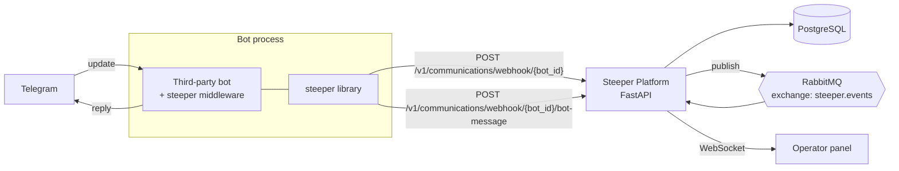
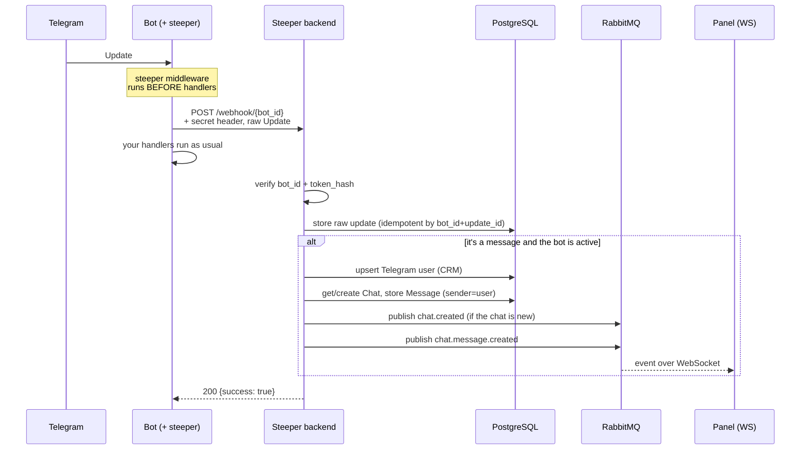
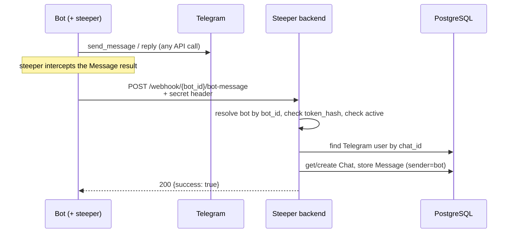

# Steeper

[](https://pypi.org/project/steeper/)
[](https://pypi.org/project/steeper/)
[](https://github.com/KarimovMurodilla/steeper/actions/workflows/ci.yml)
[](LICENSE)

Telegram bot middleware that syncs incoming user messages and outgoing bot replies with the **Steeper** platform.

> **TL;DR:** `steeper` is a thin middleware that plugs into any Telegram bot
> (aiogram / telebot / python-telegram-bot) and mirrors the entire conversation —
> incoming updates and the bot's outgoing replies — to the Steeper backend over
> HTTP. The backend stores the conversation, builds CRM/analytics, and streams
> real-time events to an operator panel.

## Contents

- [What is Steeper](#what-is-steeper)
- [Installation](#installation)
- [Configuration](#configuration)
- [Usage](#usage)
- [How it works](#how-it-works)
- [Architecture](#architecture)
- [The Steeper platform (backend)](#the-steeper-platform-backend)
- [The `steeper` library](#the-steeper-library)
- [How they interact](#how-they-interact)
- [Library guarantees and behavior](#library-guarantees-and-behavior)
- [Backend compatibility](#backend-compatibility)
- [License](#license)

---

## What is Steeper

Steeper is a platform for working with Telegram bot conversations: a single place
where you can see all user–bot dialogue, reply on behalf of the bot, run CRM and
broadcasts, and view analytics.

For the platform to "see" a bot's traffic, the bot doesn't need to be rewritten:
you just plug in the `steeper` library, which intercepts messages at the framework
level and forwards them to the backend.

The ecosystem consists of three parts:

| Part | What it is | Where it lives | Audience |
|------|------------|----------------|----------|
| **Steeper Platform (backend)** | FastAPI service: conversation storage, CRM, analytics, realtime, broadcasts. The "server" everything connects to. | Self-hosted (Docker Compose) | Whoever deploys Steeper |
| **`steeper` (library)** | Telegram bot middleware. Intercepts updates and bot replies, sends them to the backend over HTTP. | PyPI (`pip install steeper[...]`) | Third-party bot developer |
| **Operator panel (frontend)** | Web UI: chats, replies, analytics. Receives events over WebSocket. | Self-hosted alongside the backend | Operators / managers |

This repository is **only the `steeper` library**. The backend and panel live in
their own repositories; they are described here only as much as needed to
understand the integration.

### Glossary

- **bot_id** — the bot's UUID, issued by the platform when the bot is registered.
- **bot_token** — the raw bot token from BotFather.
- **token_hash** — `SHA-256(bot_token)` in hex. The authentication secret: for both
  endpoints it is sent in the `x-telegram-bot-api-secret-token` header and never
  appears in the URL. The raw token is **never** sent over the network.
- **Update** — the standard Telegram Update object (as in the Bot API).
- **Chat / Message** — the platform's internal domain entities (with their own
  UUIDs) that Telegram traffic is turned into.

---

## Installation

```bash
# Core (pick one extra for your framework)
pip install steeper[aiogram]     # aiogram v3
pip install steeper[telebot]     # pyTelegramBotAPI
pip install steeper[ptb]         # python-telegram-bot v20+
```

> **Need a backend?** Steeper is self-hosted. Run the Steeper backend (Docker Compose), create a superuser, and register a bot to get its `bot_id`. Point `base_url` at your instance. <!-- TODO: link to the backend repo / self-hosting guide -->

Runnable examples for every framework live in [`examples/`](examples/).

## Configuration

Every integration requires three values:

| Parameter   | Description                                  |
|-------------|----------------------------------------------|
| `base_url`  | Steeper backend URL (e.g. `http://localhost:8000`) |
| `bot_id`    | UUID of the bot registered in Steeper        |
| `bot_token` | Raw Telegram bot token from BotFather        |

An optional `timeout` (seconds, default `10.0`) is also accepted.

### Prerequisite: register the bot

1. Bring up the Steeper backend (Docker Compose) and create a superuser.
2. Register the bot in the platform — you'll get its **`bot_id`** (UUID). The
   backend stores the bot's `token_hash` for authentication.
3. In the bot's code, pass `base_url`, `bot_id`, and `bot_token` to
   `SteeperMiddleware`.

## Usage

### aiogram v3

```python
import asyncio

from aiogram import Bot, Dispatcher, Router
from aiogram.filters import CommandStart
from aiogram.types import Message
from steeper.integrations.aiogram import SteeperMiddleware

BOT_TOKEN = "123456:ABC-DEF..."

router = Router()


@router.message(CommandStart())
async def cmd_start(message: Message) -> None:
    await message.answer("Hello!")


async def main() -> None:
    bot = Bot(token=BOT_TOKEN)
    dp = Dispatcher()
    dp.include_router(router)

    steeper = SteeperMiddleware(
        base_url="http://localhost:8000",
        bot_id="your-bot-uuid",
        bot_token=BOT_TOKEN,
    )
    steeper.setup(dp, bot)

    await dp.start_polling(bot)


if __name__ == "__main__":
    asyncio.run(main())
```

### pyTelegramBotAPI (telebot)

```python
import telebot
from steeper.integrations.telebot import SteeperMiddleware

BOT_TOKEN = "123456:ABC-DEF..."
bot = telebot.TeleBot(BOT_TOKEN)

steeper = SteeperMiddleware(
    base_url="http://localhost:8000",
    bot_id="your-bot-uuid",
    bot_token=BOT_TOKEN,
)
steeper.setup(bot)

# ... register your handlers as usual ...
bot.polling()
```

### python-telegram-bot v20+

```python
from telegram.ext import ApplicationBuilder
from steeper.integrations.ptb import SteeperMiddleware

BOT_TOKEN = "123456:ABC-DEF..."
app = ApplicationBuilder().token(BOT_TOKEN).build()

steeper = SteeperMiddleware(
    base_url="http://localhost:8000",
    bot_id="your-bot-uuid",
    bot_token=BOT_TOKEN,
)
steeper.setup(app)

# ... register your handlers as usual ...
app.run_polling()
```

## How it works

All HTTP calls to Steeper go through **`SteeperRepository`** (`steeper.repository`): it forwards **incoming** updates and records **outgoing** bot messages to your backend. Each `SteeperMiddleware` exposes `.repository` (and `.client` for the underlying async HTTP client).

1. **Incoming** — the integration passes the **full** Telegram update, as Telegram-shaped JSON, to `repository.forward_update(...)` (every update type — messages, callback queries, inline queries, etc. — with all fields preserved). Your handlers still run as usual.

2. **Outgoing** — the integration hooks the framework so bot-originated messages are turned into `OutgoingMessageSnapshot` values and sent with `repository.record_outgoing(...)`.
   - **aiogram** — `Bot.__call__` is wrapped so any API call whose result is a `Message` (or a list of them, e.g. media groups) is logged—not only `send_message`.
   - **python-telegram-bot** — `Bot._post` is wrapped so JSON responses that decode to `Message` instances are logged (sends, edits, media groups, etc.).
   - **telebot** — `telebot.apihelper._make_request` is wrapped for your bot token so JSON `result` payloads that contain full `message` objects are logged.

If you bypass the normal API (e.g. raw HTTP to Telegram), call the repository yourself:

```python
from steeper.repository import OutgoingMessageSnapshot

await steeper.repository.record_outgoing(
    OutgoingMessageSnapshot(
        chat_id=chat_id,
        message_id=message_id,
        text="visible text or caption",
        date=None,  # optional Unix ts; if omitted, the client defaults it to the current time
    )
)
```

Failures are never fatal: if the Steeper backend is unreachable or returns an error, a warning is logged and your bot keeps working. Note the dispatch model differs per framework — for **aiogram** and **python-telegram-bot** the sync calls are awaited inline, so a slow or unreachable backend can add latency (up to the client timeout, 10s by default) per update; **telebot** dispatches them as background tasks.

---

## Architecture



The key idea: **the library knows nothing about the platform's internal model.**
It talks to just two HTTP endpoints and passes data in Telegram format. All domain
logic (chats, users, events) is done by the backend.

---

## The Steeper platform (backend)

A FastAPI application with a modular domain architecture. Full details live in the
backend repository's README and `CLAUDE.md`; here is the overview relevant to the
integration.

### What it does

- Accepts incoming Telegram updates (from a direct Telegram webhook **or** from the
  `steeper` library acting as a proxy) and stores them **verbatim**.
- Turns messages into domain `Chat` / `Message` entities and maintains CRM
  (Telegram users).
- Accepts the bot's outgoing messages and stores them as part of the conversation.
- Publishes real-time events to RabbitMQ and streams them to the panel over
  WebSocket.
- Provides an API for operators: chat list, history, replies, analytics, broadcasts.

### Technology stack

- Python 3.13, FastAPI, async SQLAlchemy + asyncpg, PostgreSQL (+ PostGIS).
- Redis (cache, token JTI store), RabbitMQ + FastStream (events), Celery (tasks).
- JWT authentication for operators, Argon2 for passwords, Fernet encryption of bot
  tokens in the DB.
- Everything runs via Docker Compose; all API routes are under the `/v1/` prefix.

### The `communication` domain (the integration point)

This is exactly where the library connects. Inside:

- `routers.py` — the two HTTP endpoints (webhook and bot-message).
- `usecases/handle_webhook.py` — handling an incoming update.
- `usecases/log_bot_message.py` — storing an outgoing bot message.
- `services/telegram_update_classifier.py` — classifying the update/content type.
- `repositories/` — `chat`, `message`, `telegram_update`.

### Realtime

The backend publishes events to the **`steeper.events` topic exchange** with routing
key `bot.{bot_id}.chat.{chat_id}.<event>`. The operator panel connects over
WebSocket, authenticates with JWT, and subscribes to a `chat_id` and/or `bot_id`.
Event types: `chat.created`, `chat.message.created`. The event envelope
(`WSDownlinkEnvelope`): `{version, event, bot_id, chat_id, timestamp, data}`.

---

## The `steeper` library

A thin middleware that plugs into a bot and mirrors traffic to the backend. It
supports three frameworks via extras:

```bash
pip install steeper[aiogram]   # aiogram v3
pip install steeper[telebot]   # pyTelegramBotAPI
pip install steeper[ptb]       # python-telegram-bot v20+
```

### Public API

```python
from steeper.integrations.aiogram import SteeperMiddleware   # or .telebot / .ptb

steeper = SteeperMiddleware(
    base_url="http://localhost:8000",   # Steeper backend address
    bot_id="00000000-0000-0000-0000-000000000000",  # bot UUID from the platform
    bot_token="123456:ABC-DEF...",      # token from BotFather
    timeout=10.0,                        # optional
)
steeper.setup(...)   # signature depends on the framework (see Usage above)
```

Additionally available (for manual scenarios):

- `steeper.SteeperConfig` — immutable config + validation, computes `token_hash`
  and the endpoint URLs.
- `steeper.SteeperRepository` — domain-oriented layer:
  `forward_update(...)`, `record_outgoing(...)`.
- `steeper.SteeperClient` — low-level async HTTP client (httpx).
- `steeper.OutgoingMessageSnapshot` — a normalized outgoing message.

### Internal layout

```
steeper/
├── _config.py        # SteeperConfig: validates base_url, token_hash, endpoint URLs
├── _client.py        # SteeperClient: httpx, sending, secret redaction in logs
├── repository.py     # SteeperRepository + OutgoingMessageSnapshot
└── integrations/
    ├── aiogram.py     # SteeperMiddleware for aiogram v3
    ├── telebot.py     # SteeperMiddleware for pyTelegramBotAPI
    └── ptb.py         # SteeperMiddleware for python-telegram-bot v20+
```

### How messages are intercepted per framework

| Framework | Incoming | Outgoing | Dispatch model |
|-----------|----------|----------|----------------|
| **aiogram v3** | outer middleware on `Update` | wrapper around `Bot.__call__` (any `Message` result is logged, including media groups) | awaited inline |
| **python-telegram-bot** | hook on update processing | wrapper around `Bot._post` (JSON decodable to `Message`) | awaited inline |
| **telebot** | middleware/handler | wrapper around `apihelper._make_request` for the bot token | background tasks |

> Latency note: for **aiogram** and **PTB** the calls to the backend are awaited
> inline, so an unreachable/slow backend can add latency up to `timeout` (10s by
> default) per update. **telebot** sends them as background tasks.

---

## How they interact

### The HTTP contract (the whole interaction is two requests)

Both endpoints identify the bot by `bot_id` in the path and authenticate with the
secret (`token_hash` = SHA-256 of the bot token) in the
`x-telegram-bot-api-secret-token` header — the secret never appears in the URL, and
the **raw `bot_token` is never sent over the network**.

| Endpoint | Purpose |
|----------|---------|
| `POST /v1/communications/webhook/{bot_id}` | Forward incoming Telegram updates (auth via `x-telegram-bot-api-secret-token` = SHA-256 of the bot token) |
| `POST /v1/communications/webhook/{token_hash}/bot-message` | Record outgoing bot messages |

| `steeper` (library) | Steeper backend API |
|---------------------|---------------------|
| `0.1.x`             | `v1`                |

**A. Incoming update**

```
POST {base_url}/v1/communications/webhook/{bot_id}
Header: x-telegram-bot-api-secret-token: <token_hash = SHA-256(bot_token)>
Body:   the full Telegram Update, as JSON (verbatim)
```

Backend responses: `200` (success), `400` (malformed payload), `403` (invalid
secret), `404` (bot not found).

**B. Outgoing bot message**

```
POST {base_url}/v1/communications/webhook/{bot_id}/bot-message
Header: x-telegram-bot-api-secret-token: <token_hash = SHA-256(bot_token)>
Body:
{
  "chat_id":    123456789,        // Telegram chat id
  "text":       "visible text or caption",
  "message_id": 42,               // Telegram message id
  "date":       1700000000        // Unix ts; if omitted, the client sets the current time
}
```

Backend responses: `200`, `400` (malformed payload), `403` (invalid secret), `404`
(bot or Telegram user not found).

### Incoming flow (user → bot → Steeper)



Backend specifics:

- **Verbatim storage and idempotency.** Every update is stored in full (even types
  not yet handled). The write is idempotent by `(bot_id, update_id)`, so Telegram
  retries don't create duplicates.
- **Only `message` / `edited_message`** with a sender are turned into a domain chat.
  Everything else is simply logged.
- **Inactive bot:** the update is stored, but the chat workflow does not run.

### Outgoing flow (bot replied → Steeper)



Important notes about the outgoing flow:

- The `bot-message` endpoint **stores** the bot's message but, in the current
  implementation, **does not publish** a realtime event (unlike the incoming flow
  and replies sent by an operator from the panel).
- Logging an outgoing message requires that the Telegram user already exists (i.e.
  the dialogue usually had an incoming update first). Otherwise the backend responds
  `404`, but that is **not fatal** for the bot (see below).

---

## Library guarantees and behavior

- **Never breaks the bot.** If the backend is unreachable or returns an error, the
  library logs a `warning` and keeps going — your handlers and replies to the user
  are unaffected.
- **Safe logs.** The `token_hash` is stripped from error text before logging (so the
  secret can't leak via a URL in an httpx message).
- **Plaintext warning.** If `base_url` is `http://` against a non-local host, the
  library warns loudly: content and the secret would travel unencrypted. Use
  `https://` in production.

---

## Backend compatibility

This library talks to the Steeper backend's **`/v1`** HTTP API. The two-endpoint
contract above must match on the client and the server.

| `steeper` (library) | Steeper backend |
|---------------------|-----------------|
| `0.2.x`             | bot-message authenticated via header (current) |
| `0.1.x`             | bot-message authenticated via `token_hash` in the URL path (legacy) |

As long as the backend keeps the `v1` contract above, any `0.1.x` client works. Breaking changes to the contract will bump the API version (`/v2`) and the library minor version together.

## License

MIT — see [LICENSE](LICENSE).
