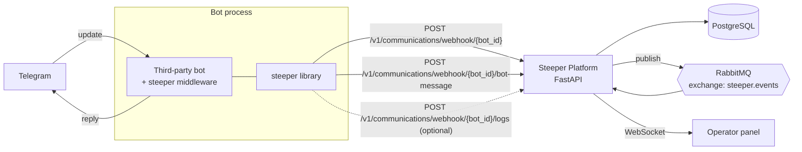
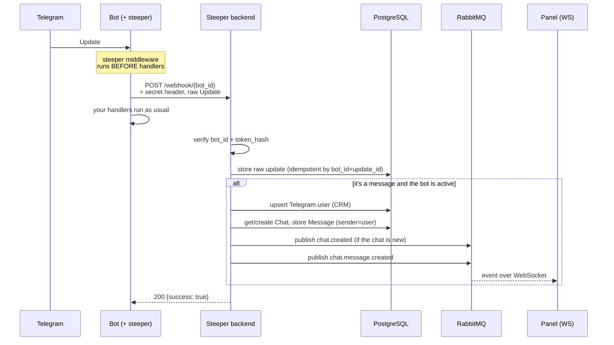
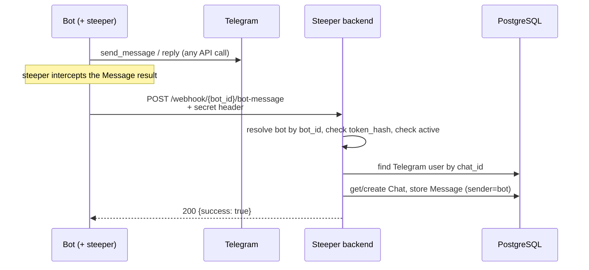

# Steeper

[](https://pypi.org/project/steeper/)
[](https://pypi.org/project/steeper/)
[](https://github.com/KarimovMurodilla/steeper/actions/workflows/ci.yml)
[](LICENSE)

Telegram bot middleware that syncs incoming user messages and outgoing bot replies with the **Steeper** platform.

> **TL;DR:** `steeper` is a thin middleware that plugs into any Telegram bot
> (aiogram / telebot / python-telegram-bot) and mirrors the entire conversation —
> incoming updates and the bot's outgoing replies — to the Steeper backend over
> HTTP. The backend stores the conversation, builds CRM/analytics, and streams
> real-time events to an operator panel.

## Contents

- [What is Steeper](#what-is-steeper)
- [Installation](#installation)
- [Configuration](#configuration)
- [Usage](#usage)
- [How it works](#how-it-works)
- [Architecture](#architecture)
- [The Steeper backend](#the-steeper-backend)
- [How they interact](#how-they-interact)
- [System logs](#system-logs)
- [Library guarantees and behavior](#library-guarantees-and-behavior)
- [Backend compatibility](#backend-compatibility)
- [License](#license)

---

## What is Steeper

Steeper is a platform for working with Telegram bot conversations: a single place
where you can see all user–bot dialogue, reply on behalf of the bot, run CRM and
broadcasts, and view analytics.

For the platform to "see" a bot's traffic, the bot doesn't need to be rewritten:
you just plug in the `steeper` library, which intercepts messages at the framework
level and forwards them to the backend.

The ecosystem consists of three parts:

| Part | What it is | Where it lives | Audience |
|------|------------|----------------|----------|
| **Steeper Platform (backend)** | FastAPI service: conversation storage, CRM, analytics, realtime, broadcasts. The "server" everything connects to. | Self-hosted (Docker Compose) | Whoever deploys Steeper |
| **`steeper` (library)** | Telegram bot middleware. Intercepts updates and bot replies, sends them to the backend over HTTP. | PyPI (`pip install steeper[...]`) | Third-party bot developer |
| **Operator panel (frontend)** | Web UI: chats, replies, analytics. Receives events over WebSocket. | Self-hosted alongside the backend | Operators / managers |

This repository is **only the `steeper` library**. The backend and panel live in
their own repositories; they are described here only as much as needed to
understand the integration.

### Glossary

- **bot_id** — the bot's UUID, issued by the platform when the bot is registered.
- **bot_token** — the raw bot token from BotFather.
- **token_hash** — `SHA-256(bot_token)` in hex. The authentication secret: for both
  endpoints it is sent in the `x-telegram-bot-api-secret-token` header and never
  appears in the URL. The raw token is **never** sent over the network.
- **Update** — the standard Telegram Update object (as in the Bot API).
- **Chat / Message** — the platform's internal domain entities (with their own
  UUIDs) that Telegram traffic is turned into.

---

## Installation

```bash
# Core (pick one extra for your framework)
pip install steeper[aiogram]     # aiogram v3
pip install steeper[telebot]     # pyTelegramBotAPI
pip install steeper[ptb]         # python-telegram-bot v20+
```

> **Need a backend?** Steeper is self-hosted. Run the Steeper backend (Docker Compose), create a superuser, and register a bot to get its `bot_id`. Point `base_url` at your instance. See [KarimovMurodilla/steeper-sdk](https://github.com/KarimovMurodilla/steeper-sdk) for the backend and its self-hosting guide.

Runnable examples for every framework live in [`examples/`](examples/).

## Configuration

Every integration requires three values:

| Parameter   | Description                                  |
|-------------|----------------------------------------------|
| `base_url`  | Steeper backend URL (e.g. `http://localhost:8000`) |
| `bot_id`    | UUID of the bot registered in Steeper        |
| `bot_token` | Raw Telegram bot token from BotFather        |

An optional `timeout` (seconds, default `10.0`) is also accepted.

### Optional: system logs

Set `capture_logs=True` and the middleware also ships the bot process's
`logging` output to Steeper, where the operator panel shows it as a live stream
with searchable history:

```python
steeper = SteeperMiddleware(
    base_url="http://localhost:8000",
    bot_id="your-bot-uuid",
    bot_token=BOT_TOKEN,
    capture_logs=True,
    log_level="INFO",
)
```

| Parameter | Default | Description |
|-----------|---------|-------------|
| `capture_logs` | `False` | Attach a `logging` handler to the root logger and ship records to Steeper |
| `log_level` | `"INFO"` | Minimum level captured. `DEBUG` on a chatty bot is a lot of traffic |
| `log_batch_size` | `100` | Records buffered before a batch is shipped (capped at 500, the backend's limit) |
| `log_flush_interval` | `2.0` | Seconds between flushes of a partial batch |
| `log_exclude_loggers` | `None` | Extra logger-name prefixes never shipped |

`steeper`'s own logger and its HTTP stack (`httpx`, `httpcore`, `h11`, …) are
always excluded — shipping them would log from inside the shipping path, which
is a loop that ends in a crash, not a dropped record. Anything you pass to
`log_exclude_loggers` is *added* to that set, never replaces it.

Capture is off by default: it is extra outbound traffic and extra storage on the
backend, so it should be an explicit choice.

### Prerequisite: register the bot

1. Bring up the Steeper backend (Docker Compose) and create a superuser.
2. Register the bot in the platform — you'll get its **`bot_id`** (UUID). The
   backend stores the bot's `token_hash` for authentication.
3. In the bot's code, pass `base_url`, `bot_id`, and `bot_token` to
   `SteeperMiddleware`.

## Usage

### aiogram v3

```python
import asyncio

from aiogram import Bot, Dispatcher, Router
from aiogram.filters import CommandStart
from aiogram.types import Message
from steeper.integrations.aiogram import SteeperMiddleware

BOT_TOKEN = "123456:ABC-DEF..."

router = Router()


@router.message(CommandStart())
async def cmd_start(message: Message) -> None:
    await message.answer("Hello!")


async def main() -> None:
    bot = Bot(token=BOT_TOKEN)
    dp = Dispatcher()
    dp.include_router(router)

    steeper = SteeperMiddleware(
        base_url="http://localhost:8000",
        bot_id="your-bot-uuid",
        bot_token=BOT_TOKEN,
    )
    steeper.setup(dp, bot)

    await dp.start_polling(bot)


if __name__ == "__main__":
    asyncio.run(main())
```

### pyTelegramBotAPI (telebot)

```python
import telebot
from steeper.integrations.telebot import SteeperMiddleware

BOT_TOKEN = "123456:ABC-DEF..."
bot = telebot.TeleBot(BOT_TOKEN)

steeper = SteeperMiddleware(
    base_url="http://localhost:8000",
    bot_id="your-bot-uuid",
    bot_token=BOT_TOKEN,
)
steeper.setup(bot)

# ... register your handlers as usual ...
bot.polling()
```

### python-telegram-bot v20+

```python
from telegram.ext import ApplicationBuilder
from steeper.integrations.ptb import SteeperMiddleware

BOT_TOKEN = "123456:ABC-DEF..."
app = ApplicationBuilder().token(BOT_TOKEN).build()

steeper = SteeperMiddleware(
    base_url="http://localhost:8000",
    bot_id="your-bot-uuid",
    bot_token=BOT_TOKEN,
)
steeper.setup(app)

# ... register your handlers as usual ...
app.run_polling()
```

## How it works

All HTTP calls to Steeper go through **`SteeperRepository`** (`steeper.repository`): it forwards **incoming** updates and records **outgoing** bot messages to your backend. Log capture is separate — see [System logs](#system-logs). Each `SteeperMiddleware` exposes `.repository` (and `.client` for the underlying async HTTP client).

1. **Incoming** — the integration passes the **full** Telegram update, as Telegram-shaped JSON, to `repository.forward_update(...)` (every update type — messages, callback queries, inline queries, etc. — with all fields preserved). Your handlers still run as usual.

2. **Outgoing** — the integration hooks the framework so bot-originated messages are turned into `OutgoingMessageSnapshot` values and sent with `repository.record_outgoing(...)`.
   - **aiogram** — `Bot.__call__` is wrapped so any API call whose result is a `Message` (or a list of them, e.g. media groups) is logged—not only `send_message`.
   - **python-telegram-bot** — `Bot._post` is wrapped so JSON responses that decode to `Message` instances are logged (sends, edits, media groups, etc.).
   - **telebot** — `telebot.apihelper._make_request` is wrapped for your bot token so JSON `result` payloads that contain full `message` objects are logged.

If you bypass the normal API (e.g. raw HTTP to Telegram), call the repository yourself:

```python
from steeper.repository import OutgoingMessageSnapshot

await steeper.repository.record_outgoing(
    OutgoingMessageSnapshot(
        chat_id=chat_id,
        message_id=message_id,
        text="visible text or caption",
        date=None,  # optional Unix ts; if omitted, the client defaults it to the current time
    )
)
```

All forwarding is **fire-and-forget** — no framework awaits the Steeper round-trip inline, so a slow or unreachable backend never adds latency to your handlers or to the bot's own API calls. Only the transport differs: for **aiogram** and **python-telegram-bot** the coroutine is scheduled on the running event loop; for **telebot**, whose handlers run on plain worker threads, it is scheduled on a shared background loop in a daemon thread. A failing backend never breaks the bot — see [Library guarantees and behavior](#library-guarantees-and-behavior).

### System logs

With `capture_logs=True`, `setup()` attaches a `SteeperLogHandler` to the root
logger. It behaves differently from update forwarding, because log volume is
orders of magnitude higher:

- **Batched, not per-record.** `emit()` only appends to an in-memory deque. A
  background thread flushes every `log_flush_interval` seconds, or as soon as
  `log_batch_size` records are waiting, and posts the batch in one request.
- **Bounded, dropping the oldest.** At most 10 000 records are held while the
  backend is unreachable. Past that the *oldest* are discarded — the opposite of
  the update forwarder, which drops the newest, because for logs the recent
  records are the ones being read.
- **Never re-entrant.** Records from `steeper` and its HTTP stack are dropped,
  and a thread-local guard breaks any remaining cycle, so a log emitted from
  inside the shipping path can't spiral.
- **Never fatal.** A record that cannot be formatted or serialized is skipped;
  `logger.info(...)` in your handlers never raises because of Steeper.
- **Shipped on its own loop and client.** Log batches go out on the shared
  background loop with a dedicated `httpx.AsyncClient`, so they never share a
  connection pool across event loops with update forwarding.

`close()` / `aclose()` detaches the handler and flushes what is still buffered
— the one place the caller does wait for the network. For async frameworks the
flush runs in a worker thread so it never blocks the bot's event loop.

To attach the handler somewhere other than the root logger, use it directly:

```python
import logging
from steeper import SteeperLogHandler

handler = SteeperLogHandler(steeper.repository.config, level=logging.WARNING)
logging.getLogger("app.payments").addHandler(handler)
```

### Shutting down

The middleware owns an `httpx.AsyncClient`, which should be closed when the bot
stops. Where the framework offers a shutdown hook, `setup()` wires it up for you:

| Framework | What you need to do |
|-----------|---------------------|
| **aiogram** | Nothing — registered on `Dispatcher.shutdown`, which `start_polling` triggers. |
| **python-telegram-bot** | Nothing under `run_polling` / `run_webhook` — chained onto `Application.post_shutdown`. |
| **telebot** | Call `steeper.close()` yourself — the framework is synchronous and has no hook. |

```python
# telebot
try:
    bot.polling()
finally:
    steeper.close()
```

If you drive the lifecycle by hand — an aiogram dispatcher you feed yourself, or a
PTB `Application.shutdown()` without `run_polling` (which does *not* run
`post_shutdown`) — call `await steeper.aclose()` at the end.

### Public API beyond the middleware

For manual scenarios, the package also exports:

- `steeper.SteeperConfig` — immutable config + validation, computes `token_hash`
  and the endpoint URLs.
- `steeper.SteeperRepository` — domain-oriented layer:
  `forward_update(...)`, `record_outgoing(...)`.
- `steeper.SteeperClient` — low-level async HTTP client (httpx).
- `steeper.OutgoingMessageSnapshot` — a normalized outgoing message.
- `steeper.SteeperLogHandler` — a `logging.Handler` that ships records to
  Steeper; `steeper.install_log_handler(...)` attaches one to a logger.

### Internal layout

```
steeper/
├── _config.py        # SteeperConfig: validates base_url, token_hash, endpoint URLs
├── _client.py        # SteeperClient: httpx, sending, secret redaction in logs
├── _logging.py       # SteeperLogHandler: capture, batching, bounded buffer
├── _log_client.py    # SteeperLogClient: httpx client for the log endpoint
├── repository.py     # SteeperRepository + OutgoingMessageSnapshot
└── integrations/
    ├── aiogram.py     # SteeperMiddleware for aiogram v3
    ├── telebot.py     # SteeperMiddleware for pyTelegramBotAPI
    └── ptb.py         # SteeperMiddleware for python-telegram-bot v20+
```

---

## Architecture


```mermaid
flowchart LR
    TG[Telegram] -->|update| BOT[Third-party bot\n+ steeper middleware]
    BOT -->|reply| TG

    subgraph CLIENT[Bot process]
        BOT --- LIB[steeper library]
    end

    LIB -->|"POST /v1/communications/webhook/{bot_id}"| API[Steeper Platform\nFastAPI]
    LIB -->|"POST /v1/communications/webhook/{bot_id}/bot-message"| API
    LIB -.->|"POST /v1/communications/webhook/{bot_id}/logs (optional)"| API

    API --> DB[(PostgreSQL)]
    API -->|publish| MQ{{RabbitMQ\nexchange: steeper.events}}
    MQ --> API
    API -->|WebSocket| UI[Operator panel]
```

The key idea: **the library knows nothing about the platform's internal model.**
It talks to just two HTTP endpoints and passes data in Telegram format. All domain
logic (chats, users, events) is done by the backend.

---

## The Steeper backend

The backend is the server side of the ecosystem and lives in its own repository:

**➜ [KarimovMurodilla/steeper-sdk](https://github.com/KarimovMurodilla/steeper-sdk)**

It is the FastAPI service this library talks to: it accepts incoming Telegram
updates and outgoing bot messages, stores them verbatim, turns them into domain
`Chat` / `Message` entities, maintains the Telegram-user CRM, publishes realtime
events to the operator panel, and exposes the operator API (chat list, history,
replies, analytics, broadcasts). It is self-hosted via Docker Compose.

Go there for deployment instructions, the full domain model, the realtime event
contract, and the authoritative `/v1` API reference. Everything this README says
about the backend is only the slice needed to understand the integration; the
endpoint contract itself is documented under
[How they interact](#how-they-interact).

---

## How they interact

### The HTTP contract (the whole interaction is two requests)

Both endpoints identify the bot by `bot_id` in the path and authenticate with the
secret (`token_hash` = SHA-256 of the bot token) in the
`x-telegram-bot-api-secret-token` header — the secret never appears in the URL, and
the **raw `bot_token` is never sent over the network**.

| Endpoint | Purpose |
|----------|---------|
| `POST /v1/communications/webhook/{bot_id}` | Forward incoming Telegram updates (auth via `x-telegram-bot-api-secret-token` = SHA-256 of the bot token) |
| `POST /v1/communications/webhook/{bot_id}/bot-message` | Record outgoing bot messages |
| `POST /v1/communications/webhook/{bot_id}/logs` | Ship a batch of `logging` records (only with `capture_logs=True`) |

**A. Incoming update**

```
POST {base_url}/v1/communications/webhook/{bot_id}
Header: x-telegram-bot-api-secret-token: <token_hash = SHA-256(bot_token)>
Body:   the full Telegram Update, as JSON (verbatim)
```

Backend responses: `200` (success), `400` (malformed payload), `403` (invalid
secret), `404` (bot not found).

**B. Outgoing bot message**

```
POST {base_url}/v1/communications/webhook/{bot_id}/bot-message
Header: x-telegram-bot-api-secret-token: <token_hash = SHA-256(bot_token)>
Body:
{
  "chat_id":    123456789,        // Telegram chat id
  "text":       "visible text or caption",
  "message_id": 42,               // Telegram message id
  "date":       1700000000        // Unix ts; if omitted, the client sets the current time
}
```

Backend responses: `200`, `400` (malformed payload), `403` (invalid secret), `404`
(bot or Telegram user not found).

**C. Log batch** (only with `capture_logs=True`)

```
POST {base_url}/v1/communications/webhook/{bot_id}/logs
Header: x-telegram-bot-api-secret-token: <token_hash = SHA-256(bot_token)>
Body:
{
  "records": [                     // 1..500 records, oldest first
    {
      "ts":      1700000000.123,   // bot-side Unix timestamp
      "level":   "ERROR",          // DEBUG | INFO | WARNING | ERROR | CRITICAL
      "logger":  "app.handlers.start",
      "message": "Failed to answer callback query",
      "module":  "start",          // optional
      "func":    "cmd_start",      // optional
      "line":    42,               // optional
      "exc":     "Traceback ...",  // optional, formatted traceback
      "extra":   {"chat_id": 1}    // optional, structured context
    }
  ]
}
```

Backend responses: `200`, `400` (malformed payload), `403` (invalid secret),
`404` (bot not found), `500` (log storage unavailable). Every non-2xx is logged
at DEBUG and the batch is dropped — the bot is never affected.

### Incoming flow (user → bot → Steeper)


```mermaid
sequenceDiagram
    participant TG as Telegram
    participant Bot as Bot (+ steeper)
    participant API as Steeper backend
    participant DB as PostgreSQL
    participant MQ as RabbitMQ
    participant UI as Panel (WS)

    TG->>Bot: Update
    Note over Bot: steeper middleware<br/>runs BEFORE handlers
    Bot->>API: POST /webhook/{bot_id}<br/>+ secret header, raw Update
    Bot->>Bot: your handlers run as usual
    API->>API: verify bot_id + token_hash
    API->>DB: store raw update (idempotent by bot_id+update_id)
    alt it's a message and the bot is active
        API->>DB: upsert Telegram user (CRM)
        API->>DB: get/create Chat, store Message (sender=user)
        API->>MQ: publish chat.created (if the chat is new)
        API->>MQ: publish chat.message.created
        MQ-->>UI: event over WebSocket
    end
    API-->>Bot: 200 {success: true}
```

Backend specifics:

- **Verbatim storage and idempotency.** Every update is stored in full (even types
  not yet handled). The write is idempotent by `(bot_id, update_id)`, so Telegram
  retries don't create duplicates.
- **Only `message` / `edited_message`** with a sender are turned into a domain chat.
  Everything else is simply logged.
- **Inactive bot:** the update is stored, but the chat workflow does not run.

### Outgoing flow (bot replied → Steeper)


```mermaid
sequenceDiagram
    participant Bot as Bot (+ steeper)
    participant TG as Telegram
    participant API as Steeper backend
    participant DB as PostgreSQL

    Bot->>TG: send_message / reply (any API call)
    Note over Bot: steeper intercepts the Message result
    Bot->>API: POST /webhook/{bot_id}/bot-message<br/>+ secret header
    API->>API: resolve bot by bot_id, check token_hash, check active
    API->>DB: find Telegram user by chat_id
    API->>DB: get/create Chat, store Message (sender=bot)
    API-->>Bot: 200 {success: true}
```

Important notes about the outgoing flow:

- The `bot-message` endpoint **stores** the bot's message but, in the current
  implementation, **does not publish** a realtime event (unlike the incoming flow
  and replies sent by an operator from the panel).
- Logging an outgoing message requires that the Telegram user already exists (i.e.
  the dialogue usually had an incoming update first). Otherwise the backend responds
  `404`, but that is **not fatal** for the bot (see below).

---

## Library guarantees and behavior

- **Never breaks the bot.** If the backend is unreachable or returns an error, the
  library logs a `warning` and keeps going — your handlers and replies to the user
  are unaffected.
- **Never slows the bot down.** Every call to Steeper, log batches included, is fire-and-forget: the
  library schedules the request and returns immediately, so the client `timeout`
  (10s by default) bounds the background request, never your handler.
- **At-most-once delivery.** A failed forward is logged and dropped — there is no
  retry or persistent queue. Steeper is an observability sidecar, not a durable
  log: if the backend is down, that traffic is not recorded.
- **Bounded memory.** At most 512 forwards may be in flight at once. Past that the
  newest ones are dropped rather than queued, so a backend outage can't grow the
  bot's memory without limit. The first drop logs a `warning`; the rest log at
  `debug` with a running total, and the warning re-arms once the queue drains.
- **Idempotent setup.** Calling `setup()` twice on the same dispatcher/bot is a
  no-op, so an accidental double registration won't mirror every message twice.
- **Safe logs.** The `token_hash` is stripped from error text before logging (so the
  secret can't leak via a URL in an httpx message).
- **Plaintext warning.** If `base_url` is `http://` against a non-local host, the
  library warns loudly: content and the secret would travel unencrypted. Use
  `https://` in production.

---

## Backend compatibility

This library talks to the Steeper backend's **`/v1`** HTTP API. The two-endpoint
contract above must match on the client and the server.

| `steeper` (library) | Steeper backend |
|---------------------|-----------------|
| `0.1.4` and newer   | bot-message authenticated via the `x-telegram-bot-api-secret-token` header (current) |
| `0.1.3` and older   | bot-message authenticated via `token_hash` in the URL path (legacy) |

`capture_logs=True` additionally requires a backend that serves
`POST /v1/communications/webhook/{bot_id}/logs`. Against an older backend the
endpoint answers `404`, log batches are dropped with a DEBUG line, and
everything else keeps working.

As long as the backend keeps the `v1` contract above, any `0.x` client works. Breaking changes to the contract will bump the API version (`/v2`) and the library minor version together.

## License

MIT — see [LICENSE](LICENSE).
