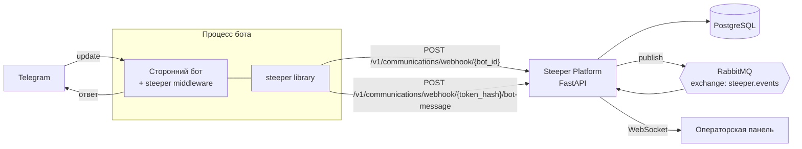
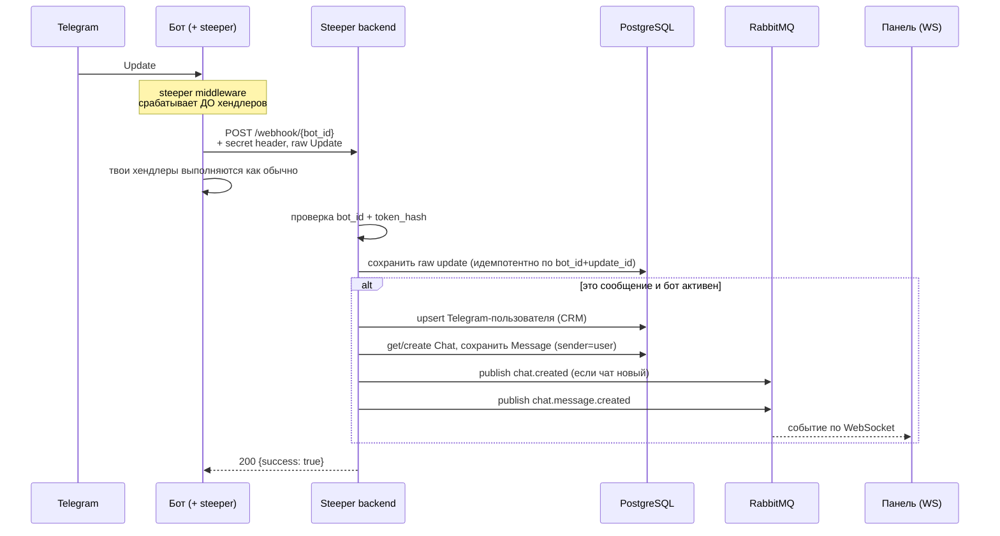
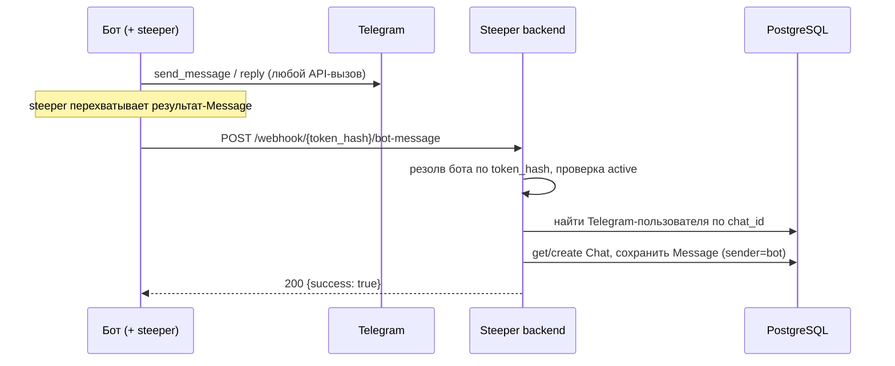

# Steeper — обзор экосистемы

Документ описывает, **что такое Steeper**, из чего он состоит, как устроены
две его части — **платформа (backend)** и **клиентская библиотека `steeper`** —
и **как они взаимодействуют** между собой.

> TL;DR: `steeper` — это тонкий middleware, который встраивается в любого
> Telegram-бота (aiogram / telebot / python-telegram-bot) и зеркалит весь
> диалог — входящие апдейты и исходящие ответы бота — в backend Steeper по
> HTTP. Backend сохраняет переписку, строит CRM/аналитику и раздаёт события
> в реальном времени операторской панели.

---

## 1. Что такое Steeper

Steeper — это платформа для работы с диалогами Telegram-ботов: единое место,
где видно всю переписку пользователей с ботами, можно отвечать от лица бота,
вести CRM, рассылки и смотреть аналитику.

Чтобы платформа «видела» трафик бота, его не нужно переписывать: достаточно
подключить библиотеку `steeper`, которая перехватывает сообщения на уровне
фреймворка и пересылает их в backend.

Экосистема состоит из трёх частей:

| Часть | Что это | Где живёт | Аудитория |
|-------|---------|-----------|-----------|
| **Steeper Platform (backend)** | FastAPI-сервис: хранение диалогов, CRM, аналитика, realtime, рассылки. Это «сервер», к которому всё подключается. | Self-hosted (Docker Compose) | Тот, кто разворачивает Steeper |
| **`steeper` (библиотека)** | Telegram-bot middleware. Перехватывает апдейты и ответы бота, шлёт их в backend по HTTP. | PyPI (`pip install steeper[...]`) | Разработчик стороннего бота |
| **Операторская панель (frontend)** | Веб-интерфейс: чаты, ответы, аналитика. Получает события по WebSocket. | Self-hosted рядом с backend | Операторы / менеджеры |

Этот репозиторий — **только библиотека `steeper`**. Платформа (backend + панель)
живёт в отдельном репозитории
[**`steeper-sdk`**](https://github.com/KarimovMurodilla/steeper-sdk)
(каталоги `backend/` и `frontend/`); здесь она описана ровно настолько, насколько
нужно для понимания интеграции.

### Глоссарий

- **bot_id** — UUID бота, выданный платформой при его регистрации.
- **bot_token** — «сырой» токен бота от BotFather.
- **token_hash** — `SHA-256(bot_token)` в hex. Используется и как секрет
  аутентификации входящих апдейтов, и как идентификатор бота в пути эндпоинта
  исходящих сообщений. Сырой токен по сети **не** передаётся.
- **Update** — стандартный объект Telegram Update (как в Bot API).
- **Chat / Message** — внутренние доменные сущности платформы (со своими UUID),
  в которые превращается Telegram-трафик.

---

## 2. Архитектура верхнего уровня



Ключевая идея: **библиотека ничего не знает о внутренней модели платформы**.
Она общается только с двумя HTTP-эндпоинтами и передаёт данные в
Telegram-формате. Всю доменную логику (чаты, пользователи, события) делает
backend.

---

## 3. Steeper Platform (backend)

FastAPI-приложение с модульной доменной архитектурой (каталог `backend/` в
репозитории [`steeper-sdk`](https://github.com/KarimovMurodilla/steeper-sdk)).
Подробности — в его README; здесь — обзор, важный для интеграции.

### Что делает

- Принимает входящие Telegram-апдейты (от прямого вебхука Telegram **или** от
  библиотеки `steeper`, выступающей прокси) и сохраняет их **дословно**.
- Превращает сообщения в доменные `Chat` / `Message`, ведёт CRM
  (Telegram-пользователи).
- Принимает исходящие сообщения бота и сохраняет их как часть диалога.
- Публикует события в реальном времени в RabbitMQ и раздаёт их панели по
  WebSocket.
- Даёт API для операторов: список чатов, история, ответы, аналитика, рассылки.

### Технологический стек

- Python 3.13, FastAPI, async SQLAlchemy + asyncpg, PostgreSQL (+ PostGIS).
- Redis (кэш, JTI-стор токенов), RabbitMQ + FastStream (события), Celery (задачи).
- JWT-аутентификация операторов, Argon2 для паролей, Fernet-шифрование токенов
  ботов в БД.
- Всё поднимается через Docker Compose; все API-маршруты под префиксом `/v1/`.

### Домен `communication` (точка интеграции)

Именно сюда обращается библиотека. Внутри:

- `routers.py` — два HTTP-эндпоинта (вебхук и bot-message).
- `usecases/handle_webhook.py` — обработка входящего апдейта.
- `usecases/log_bot_message.py` — сохранение исходящего сообщения бота.
- `services/telegram_update_classifier.py` — классификация типа апдейта/контента.
- `repositories/` — `chat`, `message`, `telegram_update`.

### Realtime

Backend публикует события в **topic-exchange `steeper.events`** с routing key
`bot.{bot_id}.chat.{chat_id}.<event>`. Операторская панель подключается по
WebSocket, проходит аутентификацию JWT и подписывается на `chat_id` и/или
`bot_id`. Типы событий: `chat.created`, `chat.message.created`. Конверт события
(`WSDownlinkEnvelope`): `{version, event, bot_id, chat_id, timestamp, data}`.

---

## 4. Библиотека `steeper`

Тонкий middleware, который встраивается в бота и зеркалит трафик в backend.
Поддерживает три фреймворка через extras:

```bash
pip install steeper[aiogram]   # aiogram v3
pip install steeper[telebot]   # pyTelegramBotAPI
pip install steeper[ptb]       # python-telegram-bot v20+
```

### Публичный API

```python
from steeper.integrations.aiogram import SteeperMiddleware   # либо .telebot / .ptb

steeper = SteeperMiddleware(
    base_url="http://localhost:8000",   # адрес backend Steeper
    bot_id="00000000-0000-0000-0000-000000000000",  # UUID бота из платформы
    bot_token="123456:ABC-DEF...",      # токен от BotFather
    timeout=10.0,                        # необязательно
)
steeper.setup(...)   # сигнатура зависит от фреймворка (см. ниже)
```

Дополнительно доступны (для ручных сценариев):

- `steeper.SteeperConfig` — иммутабельный конфиг + валидация и вычисление
  `token_hash`, URL эндпоинтов.
- `steeper.SteeperRepository` — доменно-ориентированный слой:
  `forward_update(...)`, `record_outgoing(...)`.
- `steeper.SteeperClient` — низкоуровневый async HTTP-клиент (httpx).
- `steeper.OutgoingMessageSnapshot` — нормализованное исходящее сообщение.

### Внутреннее устройство

```
steeper/
├── _config.py        # SteeperConfig: валидация base_url, token_hash, URL'ы эндпоинтов
├── _client.py        # SteeperClient: httpx, отправка, редакция секрета в логах
├── repository.py     # SteeperRepository + OutgoingMessageSnapshot
└── integrations/
    ├── aiogram.py     # SteeperMiddleware для aiogram v3
    ├── telebot.py     # SteeperMiddleware для pyTelegramBotAPI
    └── ptb.py         # SteeperMiddleware для python-telegram-bot v20+
```

### Как перехватываются сообщения по фреймворкам

| Фреймворк | Входящие | Исходящие | Модель отправки |
|-----------|----------|-----------|-----------------|
| **aiogram v3** | outer-middleware на `Update` | обёртка над `Bot.__call__` (логируется любой результат-`Message`, включая медиа-группы) | awaited inline |
| **python-telegram-bot** | хук на обработку апдейта | обёртка над `Bot._post` (JSON, декодируемый в `Message`) | awaited inline |
| **telebot** | middleware/хендлер | обёртка над `apihelper._make_request` для токена бота | фоновые задачи |

> Важное следствие по латентности: для **aiogram** и **PTB** обращения к backend
> ожидаются inline, поэтому недоступный/медленный backend может добавлять
> задержку до `timeout` (10 с по умолчанию) на апдейт. **telebot** шлёт их как
> фоновые задачи.

---

## 5. Как они взаимодействуют

### 5.0. Предусловие: регистрация бота

1. Подними backend Steeper (Docker Compose), создай суперюзера.
2. Зарегистрируй бота в платформе — получишь его **`bot_id`** (UUID). Backend
   хранит `token_hash` бота для аутентификации.
3. В коде бота передай `base_url`, `bot_id`, `bot_token` в `SteeperMiddleware`.

### 5.1. HTTP-контракт (всё взаимодействие — это два запроса)

**A. Входящий апдейт**

```
POST {base_url}/v1/communications/webhook/{bot_id}
Header: x-telegram-bot-api-secret-token: <token_hash = SHA-256(bot_token)>
Body:   полный Telegram Update, как JSON (verbatim)
```

Ответы backend: `200` (success), `400` (битый payload), `403` (неверный секрет),
`404` (бот не найден).

**B. Исходящее сообщение бота**

```
POST {base_url}/v1/communications/webhook/{token_hash}/bot-message
Body:
{
  "chat_id":    123456789,        // Telegram chat id
  "text":       "видимый текст или подпись",
  "message_id": 42,               // Telegram message id
  "date":       1700000000        // Unix ts; если не задан — клиент проставит текущее время
}
```

Ответы backend: `200`, `400`, `403`/`404` (неверный/неизвестный `token_hash`,
бот или Telegram-пользователь не найдены).

> Аутентификация построена на `token_hash`: для входящих он едет в заголовке и
> сверяется с `bot.token_hash`; для исходящих он является частью пути и по нему
> резолвится бот. **Сырой `bot_token` по сети не уходит.**

### 5.2. Входящий поток (пользователь → бот → Steeper)



Особенности backend:

- **Дословное хранение и идемпотентность.** Каждый апдейт сохраняется целиком
  (даже типы, которые пока не обрабатываются). Запись идемпотентна по
  `(bot_id, update_id)`, поэтому ретраи Telegram не создают дублей.
- **В доменный чат превращаются** только `message` / `edited_message` с
  отправителем. Остальное просто логируется.
- **Неактивный бот:** апдейт сохранится, но воркфлоу чата не запустится.

### 5.3. Исходящий поток (бот ответил → Steeper)



Важные нюансы исходящего потока:

- Эндпоинт `bot-message` **сохраняет** сообщение бота, но в текущей реализации
  **не публикует** realtime-событие (в отличие от входящего потока и ответов,
  отправленных оператором из панели).
- Логирование исходящего требует, чтобы Telegram-пользователь уже существовал
  (т.е. обычно у диалога уже был входящий апдейт). Иначе backend ответит `404`,
  но для бота это **не фатально** (см. ниже).

### 5.4. Гарантии и поведение библиотеки

- **Никогда не ломает бота.** Если backend недоступен или вернул ошибку,
  библиотека логирует `warning` и продолжает работу — твои хендлеры и ответы
  пользователю не страдают.
- **Безопасность логов.** `token_hash` вырезается из текста ошибок перед записью
  в лог (чтобы секрет не утёк через URL в сообщении httpx).
- **Предупреждение о plaintext.** Если `base_url` — это `http://` на не-локальный
  хост, библиотека громко предупреждает: контент и секрет поедут незашифрованными.
  В проде используй `https://`.

---

## 6. Быстрый старт (end-to-end)

```python
import asyncio
from aiogram import Bot, Dispatcher, Router
from aiogram.filters import CommandStart
from aiogram.types import Message
from steeper.integrations.aiogram import SteeperMiddleware

BOT_TOKEN = "123456:ABC-DEF..."
router = Router()

@router.message(CommandStart())
async def start(m: Message) -> None:
    await m.answer("Hello!")        # этот ответ тоже улетит в Steeper

async def main() -> None:
    bot = Bot(token=BOT_TOKEN)
    dp = Dispatcher(); dp.include_router(router)
    SteeperMiddleware(
        base_url="http://localhost:8000",
        bot_id="<UUID из платформы>",
        bot_token=BOT_TOKEN,
    ).setup(dp, bot)
    await dp.start_polling(bot)

asyncio.run(main())
```

Готовые примеры для всех трёх фреймворков — в каталоге [`examples/`](../examples/).

Ручное логирование (если обходишь обычный API фреймворка):

```python
from steeper.repository import OutgoingMessageSnapshot

await steeper.repository.record_outgoing(
    OutgoingMessageSnapshot(chat_id=chat_id, message_id=message_id, text="...", date=None)
)
```

---

## 7. Совместимость версий

Библиотека общается с API версии **`/v1`**. Пока backend сохраняет контракт двух
эндпоинтов из раздела 5.1, любой клиент `0.1.x` совместим с ним.

| `steeper` (библиотека) | Steeper backend API |
|------------------------|---------------------|
| `0.1.x`                | `v1`                |

Ломающие изменения контракта поднимут версию API (`/v2`) и минорную версию
библиотеки одновременно. Изменения отслеживаются в [`CHANGELOG.md`](../CHANGELOG.md).

---

## 8. Кратко

- **Платформа (backend)** — сервер: хранит диалоги, ведёт CRM/аналитику,
  раздаёт realtime. Self-hosted.
- **Библиотека `steeper`** — клиент: встраивается в бота, зеркалит входящие и
  исходящие сообщения в backend по двум HTTP-эндпоинтам.
- **Связь между ними** — простой HTTP-контракт в Telegram-формате, с
  аутентификацией по `token_hash` и принципом «backend упал — бот живёт».
