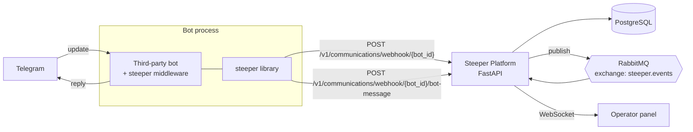
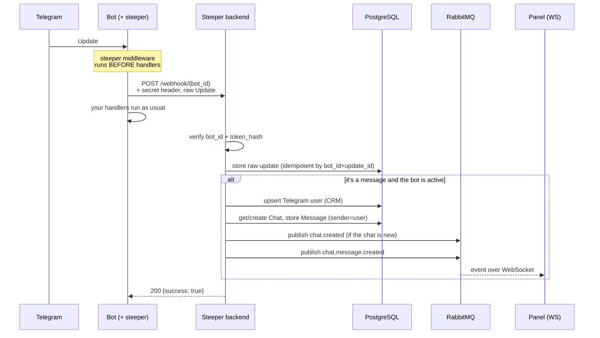
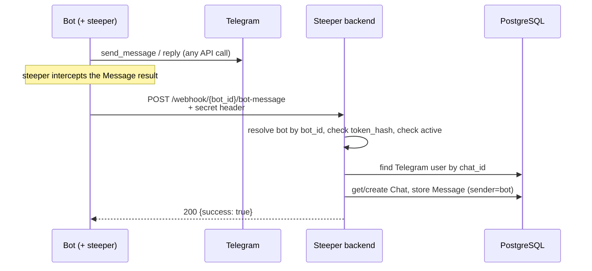

# Steeper — ecosystem overview

This document explains **what Steeper is**, what it consists of, how its two
parts — the **platform (backend)** and the **`steeper` client library** — are
built, and **how they interact** with each other.

> TL;DR: `steeper` is a thin middleware that plugs into any Telegram bot
> (aiogram / telebot / python-telegram-bot) and mirrors the entire
> conversation — incoming updates and the bot's outgoing replies — to the
> Steeper backend over HTTP. The backend stores the conversation, builds
> CRM/analytics, and streams real-time events to an operator panel.

---

## 1. What is Steeper

Steeper is a platform for working with Telegram bot conversations: a single
place where you can see all user–bot dialogue, reply on behalf of the bot, run
CRM and broadcasts, and view analytics.

For the platform to "see" a bot's traffic, the bot doesn't need to be rewritten:
you just plug in the `steeper` library, which intercepts messages at the
framework level and forwards them to the backend.

The ecosystem consists of three parts:

| Part | What it is | Where it lives | Audience |
|------|------------|----------------|----------|
| **Steeper Platform (backend)** | FastAPI service: conversation storage, CRM, analytics, realtime, broadcasts. The "server" everything connects to. | Self-hosted (Docker Compose) | Whoever deploys Steeper |
| **`steeper` (library)** | Telegram bot middleware. Intercepts updates and bot replies, sends them to the backend over HTTP. | PyPI (`pip install steeper[...]`) | Third-party bot developer |
| **Operator panel (frontend)** | Web UI: chats, replies, analytics. Receives events over WebSocket. | Self-hosted alongside the backend | Operators / managers |

This repository is **only the `steeper` library**. The backend and panel live in
their own repositories; they are described here only as much as needed to
understand the integration.

### Glossary

- **bot_id** — the bot's UUID, issued by the platform when the bot is registered.
- **bot_token** — the raw bot token from BotFather.
- **token_hash** — `SHA-256(bot_token)` in hex. The authentication secret: for
  both endpoints it is sent in the `x-telegram-bot-api-secret-token` header and
  never appears in the URL. The raw token is **never** sent over the network.
- **Update** — the standard Telegram Update object (as in the Bot API).
- **Chat / Message** — the platform's internal domain entities (with their own
  UUIDs) that Telegram traffic is turned into.

---

## 2. High-level architecture


```mermaid
flowchart LR
    TG[Telegram] -->|update| BOT[Third-party bot\n+ steeper middleware]
    BOT -->|reply| TG

    subgraph CLIENT[Bot process]
        BOT --- LIB[steeper library]
    end

    LIB -->|"POST /v1/communications/webhook/{bot_id}"| API[Steeper Platform\nFastAPI]
    LIB -->|"POST /v1/communications/webhook/{bot_id}/bot-message"| API

    API --> DB[(PostgreSQL)]
    API -->|publish| MQ{{RabbitMQ\nexchange: steeper.events}}
    MQ --> API
    API -->|WebSocket| UI[Operator panel]
```

The key idea: **the library knows nothing about the platform's internal model.**
It talks to just two HTTP endpoints and passes data in Telegram format. All
domain logic (chats, users, events) is done by the backend.

---

## 3. Steeper Platform (backend)

A FastAPI application with a modular domain architecture. Full details live in
the backend repository's README and `CLAUDE.md`; here is the overview relevant to
the integration.

### What it does

- Accepts incoming Telegram updates (from a direct Telegram webhook **or** from
  the `steeper` library acting as a proxy) and stores them **verbatim**.
- Turns messages into domain `Chat` / `Message` entities and maintains CRM
  (Telegram users).
- Accepts the bot's outgoing messages and stores them as part of the
  conversation.
- Publishes real-time events to RabbitMQ and streams them to the panel over
  WebSocket.
- Provides an API for operators: chat list, history, replies, analytics,
  broadcasts.

### Technology stack

- Python 3.13, FastAPI, async SQLAlchemy + asyncpg, PostgreSQL (+ PostGIS).
- Redis (cache, token JTI store), RabbitMQ + FastStream (events), Celery (tasks).
- JWT authentication for operators, Argon2 for passwords, Fernet encryption of
  bot tokens in the DB.
- Everything runs via Docker Compose; all API routes are under the `/v1/` prefix.

### The `communication` domain (the integration point)

This is exactly where the library connects. Inside:

- `routers.py` — the two HTTP endpoints (webhook and bot-message).
- `usecases/handle_webhook.py` — handling an incoming update.
- `usecases/log_bot_message.py` — storing an outgoing bot message.
- `services/telegram_update_classifier.py` — classifying the update/content type.
- `repositories/` — `chat`, `message`, `telegram_update`.

### Realtime

The backend publishes events to the **`steeper.events` topic exchange** with
routing key `bot.{bot_id}.chat.{chat_id}.<event>`. The operator panel connects
over WebSocket, authenticates with JWT, and subscribes to a `chat_id` and/or
`bot_id`. Event types: `chat.created`, `chat.message.created`. The event envelope
(`WSDownlinkEnvelope`): `{version, event, bot_id, chat_id, timestamp, data}`.

---

## 4. The `steeper` library

A thin middleware that plugs into a bot and mirrors traffic to the backend. It
supports three frameworks via extras:

```bash
pip install steeper[aiogram]   # aiogram v3
pip install steeper[telebot]   # pyTelegramBotAPI
pip install steeper[ptb]       # python-telegram-bot v20+
```

### Public API

```python
from steeper.integrations.aiogram import SteeperMiddleware   # or .telebot / .ptb

steeper = SteeperMiddleware(
    base_url="http://localhost:8000",   # Steeper backend address
    bot_id="00000000-0000-0000-0000-000000000000",  # bot UUID from the platform
    bot_token="123456:ABC-DEF...",      # token from BotFather
    timeout=10.0,                        # optional
)
steeper.setup(...)   # signature depends on the framework (see below)
```

Additionally available (for manual scenarios):

- `steeper.SteeperConfig` — immutable config + validation, computes `token_hash`
  and the endpoint URLs.
- `steeper.SteeperRepository` — domain-oriented layer:
  `forward_update(...)`, `record_outgoing(...)`.
- `steeper.SteeperClient` — low-level async HTTP client (httpx).
- `steeper.OutgoingMessageSnapshot` — a normalized outgoing message.

### Internal layout

```
steeper/
├── _config.py        # SteeperConfig: validates base_url, token_hash, endpoint URLs
├── _client.py        # SteeperClient: httpx, sending, secret redaction in logs
├── repository.py     # SteeperRepository + OutgoingMessageSnapshot
└── integrations/
    ├── aiogram.py     # SteeperMiddleware for aiogram v3
    ├── telebot.py     # SteeperMiddleware for pyTelegramBotAPI
    └── ptb.py         # SteeperMiddleware for python-telegram-bot v20+
```

### How messages are intercepted per framework

| Framework | Incoming | Outgoing | Dispatch model |
|-----------|----------|----------|----------------|
| **aiogram v3** | outer middleware on `Update` | wrapper around `Bot.__call__` (any `Message` result is logged, including media groups) | awaited inline |
| **python-telegram-bot** | hook on update processing | wrapper around `Bot._post` (JSON decodable to `Message`) | awaited inline |
| **telebot** | middleware/handler | wrapper around `apihelper._make_request` for the bot token | background tasks |

> Latency note: for **aiogram** and **PTB** the calls to the backend are awaited
> inline, so an unreachable/slow backend can add latency up to `timeout` (10s by
> default) per update. **telebot** sends them as background tasks.

---

## 5. How they interact

### 5.0. Prerequisite: register the bot

1. Bring up the Steeper backend (Docker Compose) and create a superuser.
2. Register the bot in the platform — you'll get its **`bot_id`** (UUID). The
   backend stores the bot's `token_hash` for authentication.
3. In the bot's code, pass `base_url`, `bot_id`, and `bot_token` to
   `SteeperMiddleware`.

### 5.1. The HTTP contract (the whole interaction is two requests)

**A. Incoming update**

```
POST {base_url}/v1/communications/webhook/{bot_id}
Header: x-telegram-bot-api-secret-token: <token_hash = SHA-256(bot_token)>
Body:   the full Telegram Update, as JSON (verbatim)
```

Backend responses: `200` (success), `400` (malformed payload), `403` (invalid
secret), `404` (bot not found).

**B. Outgoing bot message**

```
POST {base_url}/v1/communications/webhook/{bot_id}/bot-message
Header: x-telegram-bot-api-secret-token: <token_hash = SHA-256(bot_token)>
Body:
{
  "chat_id":    123456789,        // Telegram chat id
  "text":       "visible text or caption",
  "message_id": 42,               // Telegram message id
  "date":       1700000000        // Unix ts; if omitted, the client sets the current time
}
```

Backend responses: `200`, `400` (malformed payload), `403` (invalid secret),
`404` (bot or Telegram user not found).

> Authentication is based on `token_hash`: for both endpoints the bot is
> identified by `bot_id` in the path, and the secret travels in the
> `x-telegram-bot-api-secret-token` header, where it is checked against
> `bot.token_hash`. **The raw `bot_token` never leaves the process.**

### 5.2. Incoming flow (user → bot → Steeper)


```mermaid
sequenceDiagram
    participant TG as Telegram
    participant Bot as Bot (+ steeper)
    participant API as Steeper backend
    participant DB as PostgreSQL
    participant MQ as RabbitMQ
    participant UI as Panel (WS)

    TG->>Bot: Update
    Note over Bot: steeper middleware<br/>runs BEFORE handlers
    Bot->>API: POST /webhook/{bot_id}<br/>+ secret header, raw Update
    Bot->>Bot: your handlers run as usual
    API->>API: verify bot_id + token_hash
    API->>DB: store raw update (idempotent by bot_id+update_id)
    alt it's a message and the bot is active
        API->>DB: upsert Telegram user (CRM)
        API->>DB: get/create Chat, store Message (sender=user)
        API->>MQ: publish chat.created (if the chat is new)
        API->>MQ: publish chat.message.created
        MQ-->>UI: event over WebSocket
    end
    API-->>Bot: 200 {success: true}
```

Backend specifics:

- **Verbatim storage and idempotency.** Every update is stored in full (even
  types not yet handled). The write is idempotent by `(bot_id, update_id)`, so
  Telegram retries don't create duplicates.
- **Only `message` / `edited_message`** with a sender are turned into a domain
  chat. Everything else is simply logged.
- **Inactive bot:** the update is stored, but the chat workflow does not run.

### 5.3. Outgoing flow (bot replied → Steeper)


```mermaid
sequenceDiagram
    participant Bot as Bot (+ steeper)
    participant TG as Telegram
    participant API as Steeper backend
    participant DB as PostgreSQL

    Bot->>TG: send_message / reply (any API call)
    Note over Bot: steeper intercepts the Message result
    Bot->>API: POST /webhook/{bot_id}/bot-message<br/>+ secret header
    API->>API: resolve bot by bot_id, check token_hash, check active
    API->>DB: find Telegram user by chat_id
    API->>DB: get/create Chat, store Message (sender=bot)
    API-->>Bot: 200 {success: true}
```

Important notes about the outgoing flow:

- The `bot-message` endpoint **stores** the bot's message but, in the current
  implementation, **does not publish** a realtime event (unlike the incoming flow
  and replies sent by an operator from the panel).
- Logging an outgoing message requires that the Telegram user already exists
  (i.e. the dialogue usually had an incoming update first). Otherwise the backend
  responds `404`, but that is **not fatal** for the bot (see below).

### 5.4. Library guarantees and behavior

- **Never breaks the bot.** If the backend is unreachable or returns an error,
  the library logs a `warning` and keeps going — your handlers and replies to the
  user are unaffected.
- **Safe logs.** The `token_hash` is stripped from error text before logging (so
  the secret can't leak via a URL in an httpx message).
- **Plaintext warning.** If `base_url` is `http://` against a non-local host, the
  library warns loudly: content and the secret would travel unencrypted. Use
  `https://` in production.

---

## 6. Quick start (end-to-end)

```python
import asyncio
from aiogram import Bot, Dispatcher, Router
from aiogram.filters import CommandStart
from aiogram.types import Message
from steeper.integrations.aiogram import SteeperMiddleware

BOT_TOKEN = "123456:ABC-DEF..."
router = Router()

@router.message(CommandStart())
async def start(m: Message) -> None:
    await m.answer("Hello!")        # this reply is mirrored to Steeper too

async def main() -> None:
    bot = Bot(token=BOT_TOKEN)
    dp = Dispatcher(); dp.include_router(router)
    SteeperMiddleware(
        base_url="http://localhost:8000",
        bot_id="<UUID from the platform>",
        bot_token=BOT_TOKEN,
    ).setup(dp, bot)
    await dp.start_polling(bot)

asyncio.run(main())
```

Runnable examples for all three frameworks live in the [`examples/`](../examples/)
directory.

Manual logging (if you bypass the framework's normal API):

```python
from steeper.repository import OutgoingMessageSnapshot

await steeper.repository.record_outgoing(
    OutgoingMessageSnapshot(chat_id=chat_id, message_id=message_id, text="...", date=None)
)
```

---

## 7. Version compatibility

The library talks to the **`/v1`** API. As long as the backend keeps the
two-endpoint contract from section 5.1, any `0.1.x` client is compatible with it.

| `steeper` (library) | Steeper backend API |
|---------------------|---------------------|
| `0.1.x`             | `v1`                |

Breaking changes to the contract will bump the API version (`/v2`) and the
library minor version together. Changes are tracked in
[`CHANGELOG.md`](../CHANGELOG.md).

---

## 8. In brief

- **Platform (backend)** — the server: stores conversations, runs CRM/analytics,
  streams realtime. Self-hosted.
- **`steeper` library** — the client: plugs into a bot, mirrors incoming and
  outgoing messages to the backend over two HTTP endpoints.
- **The link between them** — a simple HTTP contract in Telegram format, with
  `token_hash`-based authentication and a "backend is down → the bot lives on"
  principle.
